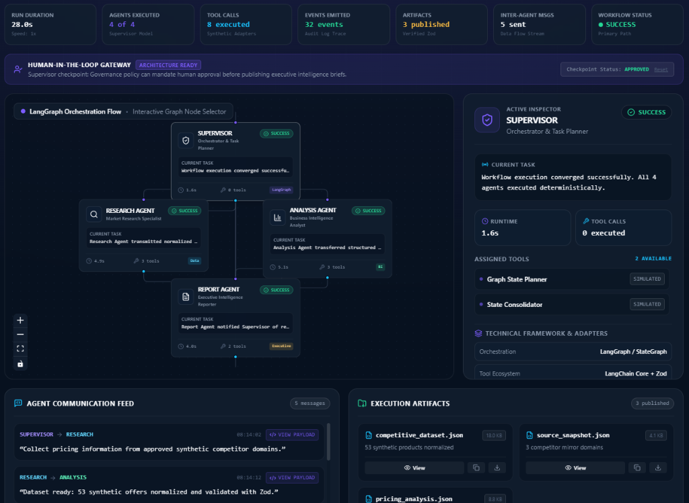
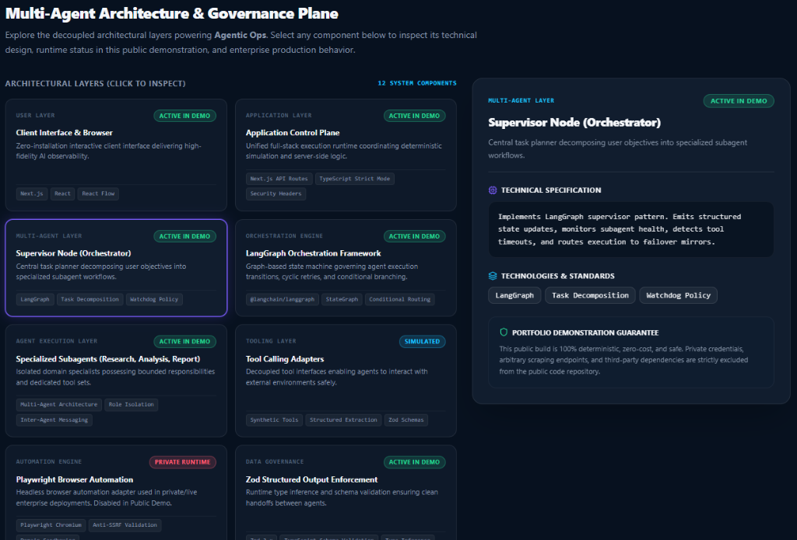
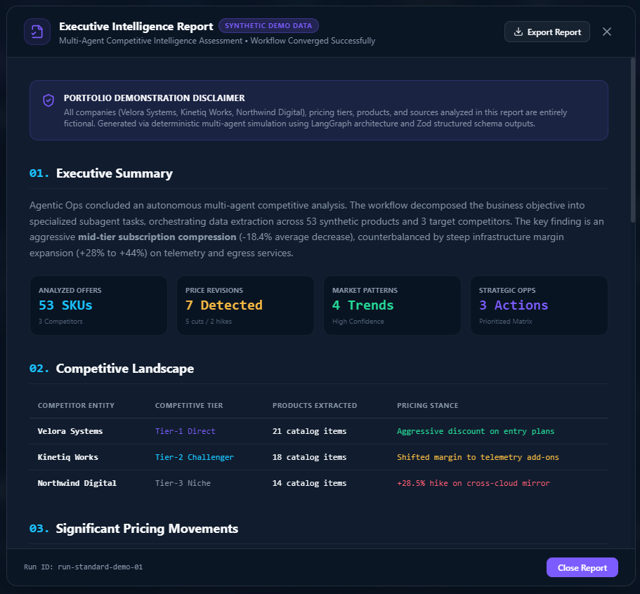

# AGENTIC OPS
## AI OPERATIONS CONTROL CENTER

> **Multi-Agent AI systems for research, analysis and business automation.**  
> *An interactive portfolio demonstration of multi-agent orchestration, tool calling, workflow execution and AI observability.*

---

### 🛡️ Portfolio Demo Disclaimer
> **IMPORTANT:** This repository is a public portfolio demonstration. All organizations (*Velora Systems*, *Kinetiq Works*, *Northwind Digital*), products, pricing catalogs, sources, and datasets presented in this application are strictly **fictional**. The hosted demonstration utilizes a **deterministic in-memory simulation engine** and **does not require API keys, accounts, or external services**.

---

## 🚀 Live Demo & Presentation Highlights

- **Zero-Install Experience:** Runs directly in any modern web browser.
- **Deterministic Observability:** 32+ discrete execution events, inter-agent messages, and tool durations.
- **Interactive Workflow Graph:** Custom React Flow graph with active particle flows and real-time inspector.
- **Dual Presentation Modes:**
  - **Tech Mode:** View raw event names, agent IDs, and inspect structured JSON payloads.
  - **Presentation Mode:** High-readability view for live client demonstrations.
- **Autonomous Error Recovery:** Test the **Simulate Failure** scenario to observe the Supervisor watchdog intercept a 504 tool timeout and reroute to an encrypted fallback mirror.
- **Exportable Deliverables:** Download validated synthetic artifacts (`competitive_dataset.json`, `pricing_analysis.json`, `executive_report.md`).

---

## 📸 Visual Demonstration Preview

### 1. AI Operations Control Center — Multi-Agent Workflow & Observability Workspace


### 2. Multi-Agent Architecture & Governance Plane


### 3. Executive Intelligence Report & Synthetic Deliverable


---

## 🏛️ System Architecture

```
+-------------------------------------------------------------------------+
|                               USER LAYER                                |
|  Next.js 14 Web UI • React Flow Graph • Observability Stream • Modals   |
+-------------------------------------------------------------------------+
                                    |
                                    v
+-------------------------------------------------------------------------+
|                          EXECUTION & RUNTIME                            |
|    Simulation Engine (Public Demo)  /  LangGraph Engine (Private Live)  |
+-------------------------------------------------------------------------+
                                    |
                                    v
+-------------------------------------------------------------------------+
|                        SUPERVISOR ORCHESTRATOR                          |
|         Task Decomposition • State Aggregation • Watchdog Recovery       |
+-------------------------------------------------------------------------+
             |                                             |
             v                                             v
+-------------------------+                   +-------------------------+
|     RESEARCH AGENT      |                   |     ANALYSIS AGENT      |
|  Market Catalog Scan    |                   |  Variance & Pattern BI  |
|  Browser Tool Adapter   |                   |  Opportunity Ranking    |
+-------------------------+                   +-------------------------+
             |                                             |
             +----------------------+----------------------+
                                    |
                                    v
+-------------------------------------------------------------------------+
|                              REPORT AGENT                               |
|        Executive Brief Synthesizer • Evidence Compilation & Hash        |
+-------------------------------------------------------------------------+
                                    |
                                    v
+-------------------------------------------------------------------------+
|                           DELIVERABLE LAYER                             |
|  competitive_dataset.json • pricing_analysis.json • executive_report.md  |
+-------------------------------------------------------------------------+
                                    |
                                    v
+-------------------------------------------------------------------------+
|                           PERSISTENCE LAYER                             |
|        PostgreSQL / Supabase Schema • pgvector Semantic Embeddings       |
+-------------------------------------------------------------------------+
```

---

## 📊 Technology Stack Matrix

| Technology | Purpose | Demo Status |
| :--- | :--- | :--- |
| **Next.js 14** | Web application framework (App Router) | **ACTIVE** |
| **TypeScript** | Strict-mode application typing | **ACTIVE** |
| **React Flow (@xyflow/react)** | Interactive agent workflow graph & animated data edges | **ACTIVE** |
| **Framer Motion** | UI transitions and modal animations | **ACTIVE** |
| **Tailwind CSS** | Enterprise dark-theme design system | **ACTIVE** |
| **LangGraph** | Multi-agent state machine & supervisor orchestration | **ACTIVE (SIMULATED)** / **PRIVATE RUNTIME** |
| **LangChain Core** | Agent/tool interface contracts | **ACTIVE (SIMULATED)** / **PRIVATE RUNTIME** |
| **Zod** | Schema validation & structured output enforcement | **ACTIVE** |
| **OpenAI API** | LLM provider adapter | **PRIVATE ONLY** |
| **Playwright** | Headless browser automation adapter with anti-SSRF guards | **PRIVATE ONLY** |
| **PostgreSQL / Supabase** | Relational persistence & Realtime subscriptions | **OPTIONAL (SCHEMA READY)** |
| **pgvector** | HNSW vector indexing for future RAG / Knowledge workflows | **ARCHITECTURE READY** |

---

## 🤖 The Multi-Agent Operational Team

### 1. SUPERVISOR (Orchestrator)
- **Role:** Central Task Planner & Graph Supervisor.
- **Responsibilities:** Ingests objectives, decomposes them into structured subagent tasks, tracks graph state, intercepts failures, and triggers the executive synthesis phase.

### 2. RESEARCH AGENT (Market Research Specialist)
- **Role:** Web & Document Extraction Specialist.
- **Responsibilities:** Inspects synthetic competitor domains, parses product matrices, normalizes pricing into USD baselines, and validates datasets using Zod.
- **Tools:** Browser Research, Page Parser, Pricing Extractor, Data Normalizer.

### 3. ANALYSIS AGENT (Business Intelligence Analyst)
- **Role:** Quantitative BI & Strategy Analyst.
- **Responsibilities:** Evaluates 53 products across 3 competitors, flags 7 critical price movements, identifies 4 strategic market trends, and scores 3 actionable opportunities.
- **Tools:** Price Variance Engine, Pattern Detector, Opportunity Ranker.

### 4. REPORT AGENT (Executive Intelligence Reporter)
- **Role:** Executive Communication Specialist.
- **Responsibilities:** Synthesizes structured analytical findings into a C-level intelligence report, compiles SHA-256 evidence links, and certifies outputs with synthetic verification watermarks.
- **Tools:** Markdown Synthesizer, Evidence & Source Compiler.

---

## 🔒 Security & Safe Public Publication

- **Zero Secret Exposure:** No API keys, credentials, or service role tokens exist anywhere in the repository.
- **Strict Server/Client Demarcation:** Private configuration functions (`getPrivateConfig()`) reject client-side browser execution.
- **Anti-SSRF Protections:** Browser automation adapters validate protocol (`http/https`), block loopback/localhost, reject RFC1918 private subnets, and disallow cloud instance metadata endpoints (`169.254.169.254`).
- **Telemetry Redaction:** All persisted logs pass through recursive secret redaction (`redactSensitiveData()`).

For more details, see [`SECURITY.md`](./SECURITY.md) and [`SECURITY_CHECKLIST.md`](./SECURITY_CHECKLIST.md).

---

## 💻 Local Development Setup

To run the project locally:

```bash
# 1. Clone the repository
git clone <repository-url>
cd hub-ia-agentes

# 2. Install dependencies
npm install

# 3. Start development server
npm run dev
```

Open [http://localhost:3000](http://localhost:3000) in your browser.

### Verification Scripts
```bash
# Typecheck
npm run typecheck

# Lint
npm run lint

# Production Build
npm run build
```

---

## 📚 Architectural Documentation Directory

- [`docs/architecture.md`](./docs/architecture.md) — Comprehensive technical layer breakdown.
- [`docs/langgraph-architecture.md`](./docs/langgraph-architecture.md) — Graph state, nodes, edges, and failover routing.
- [`docs/security.md`](./docs/security.md) — Defense principles, anti-SSRF specs, and redaction policies.
- [`docs/demo-mode.md`](./docs/demo-mode.md) — Zero-install execution engine details.
- [`docs/rag-architecture.md`](./docs/rag-architecture.md) — pgvector schema and semantic memory expansion.
- [`docs/future-agents.md`](./docs/future-agents.md) — Architecture specs for IT Ops, Support, Sales, and Marketing agents.
- [`supabase/schema.sql`](./supabase/schema.sql) — Complete PostgreSQL & pgvector database DDL.

---

## 📄 License
This project is released under the **MIT License** for portfolio demonstration and professional evaluation.
